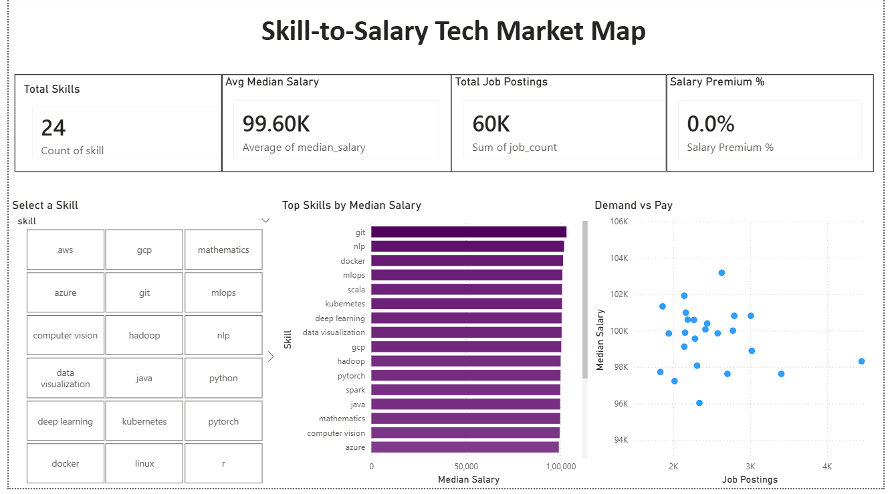

# 🗺️ Skill-to-Salary Tech Market Map

An end-to-end data analytics ETL pipeline that transforms 15,000 raw AI/ML 
job postings into a Power BI dashboard revealing which technical skills 
command the highest salaries in today's AI engineering job market.

---

## Dashboard Preview


---

## 🛠️ Tech Stack

| Layer | Tool |
|---|---|
| Data Cleaning | Python · Pandas |
| Aggregation | Python · MySQL |
| Visualization | Power BI · DAX |
| Version Control | Git · GitHub |

---

## 🏗️ Project Architecture

```
Skill-to-Salary-Tech-Market-Map/
│
├── scripts/
│   ├── 01_data_cleaning.py       # Pandas ETL: clean, parse, explode, normalize
│   └── 02_sql_aggregations.py    # MySQL CTE: median salary per skill
│
├── dashboard/
│   └── dashboard_preview.png     # Power BI dashboard screenshot
│
└── README.md
```

**Pipeline Flow:**

```
ai_job_dataset.csv (15,000 raw AI/ML job postings)
        │
        ▼
01_data_cleaning.py
→ Rename columns to pipeline standard
  (salary_usd → salary_year_avg, required_skills → job_skills)
→ Drop null salaries (retains all 15,000 rows — no nulls in this dataset)
→ Parse messy skill arrays using ast.literal_eval
→ Explode to one skill per row
→ Normalize all skills to lowercase
        │
        ▼
cleaned_skills_data.csv (59,893 skill-rows · 3 columns)
        │
        ▼
02_sql_aggregations.py
→ Pre-compute median salary per skill in Pandas
→ Load into MySQL database (skill_salary_db)
→ CTE aggregation: median salary + job count per skill
→ Filter: minimum 100 job postings
→ Sort: highest median salary first
        │
        ▼
final_powerbi_data.csv (24 qualifying skills · 4 columns)
        │
        ▼
Power BI Dashboard
→ KPI cards: Total Skills · Avg Median Salary · Total Job Postings · Salary Premium %
→ Bar chart: skills ranked by median salary (gradient purple)
→ Scatter plot: job count vs median salary — the demand vs pay sweet spot
→ Slicer: click any skill to filter all visuals interactively
→ DAX measure: Salary Premium % vs dataset average
```

---

## 🚀 How to Run Locally

### Prerequisites
- Python 3.8+
- MySQL Server running on localhost
- Power BI Desktop

### 1. Clone the repository
```bash
git clone https://github.com/radhikachafle/Skill-to-Salary-Tech-Market-Map.git
cd Skill-to-Salary-Tech-Market-Map
```

### 2. Install dependencies
```bash
pip install pandas mysql-connector-python
```

### 3. Add the raw data
Download `ai_job_dataset.csv` and place it at:
```
data/raw/ai_job_dataset.csv
```

### 4. Configure MySQL credentials
Open `scripts/02_sql_aggregations.py` and update:
```python
DB_CONFIG = {
    "host":     "localhost",
    "port":     3306,
    "user":     "root",
    "password": "your_password_here",
    "database": "skill_salary_db"
}
```

### 5. Run the pipeline in order
```bash
python scripts/01_data_cleaning.py
python scripts/02_sql_aggregations.py
```

### 6. Open Power BI
Import `data/processed/final_powerbi_data.csv` into Power BI Desktop
and open `dashboard/skill_salary_dashboard.pbix`

---

## 📈 Key Business Insights

- 🥇 **Highest paying skill:** Git at $103,182 median salary
- 📦 **Most in-demand skill:** Python with 4,450 job postings
- 💡 **Best ROI skill:** Kubernetes — top 6 in salary AND top 3 in demand
- 📉 **Oversupplied skill:** Python — highest posting volume but ranks 18th in salary
- 🤖 **AI/ML skills command a premium:** PyTorch, TensorFlow, and Deep Learning all sit above $100K median
- 📊 **Tight salary range:** Only $7,982 separates highest (Git $103K) from lowest (Excel $95K) paid skill

---

## ⚠️ Data Notes

This dataset (`ai_job_dataset.csv`, 15,000 AI/ML job postings) shows a 
notably tight salary range across skills — only $7,982 separating the 
highest-paid skill (Git, $103,182) from the lowest (Excel, $95,200), 
roughly an 8% spread. This is narrower than typically seen in real-world 
job market data, suggesting either a specialized senior-leaning talent 
pool or characteristics of synthetic sample data. The relative ranking 
of skills remains directionally meaningful even if absolute salary 
figures should be interpreted with this caveat in mind.

---

## 📂 Dataset

| Property | Value |
|---|---|
| Source | https://www.kaggle.com/datasets/bismasajjad/global-ai-job-market-and-salary-trends-2025 |
| Raw rows | 15,000 job postings |
| After skill explode | 59,893 skill-rows |
| Skills in final output | 24 qualifying skills |
| Minimum postings filter | 100 job postings per skill |
| Salary column used | `salary_usd` (standardized) |
| Skills column used | `required_skills` |

---

## 📄 License
[MIT](LICENSE)
